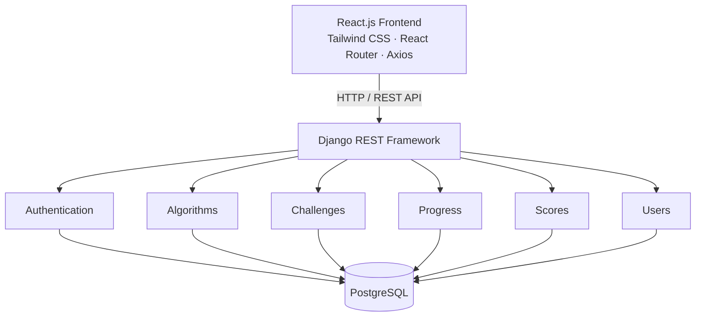
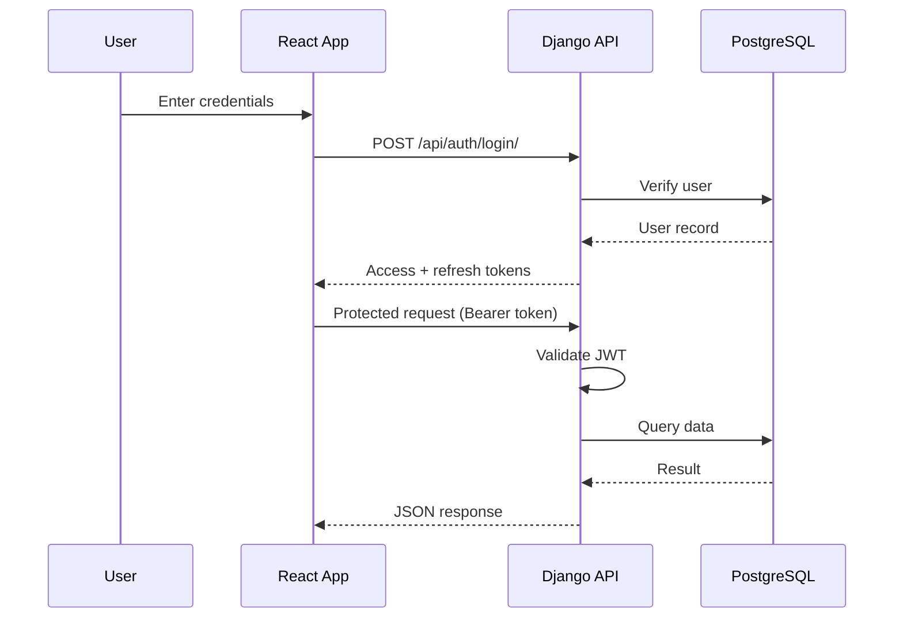

# CodeLens

**An interactive programming education platform that turns algorithm execution into a visual, step-by-step learning experience.**


---

## Table of Contents

- [Overview](#overview)
- [Key Features](#key-features)
- [Tech Stack](#tech-stack)
- [System Architecture](#system-architecture)
- [Authentication & Roles](#authentication--roles)
- [Database Design](#database-design)
- [Project Structure](#project-structure)
- [Getting Started](#getting-started)
- [API Overview](#api-overview)
- [Roadmap](#roadmap)
- [Contributing](#contributing)
- [License](#license)

---

## Overview

CodeLens is a full-stack web platform that helps students understand data structures and algorithms by *watching* them run. Instead of reading static pseudocode, learners step through each comparison, swap and traversal, then test their understanding through graded challenges and track their growth on a personal analytics dashboard.

The platform combines:

- Algorithm visualization
- Data-structure manipulation
- Challenge evaluation
- Complexity analysis
- Student performance analytics

React powers the dynamic visualization UI, while Django REST Framework handles authentication, persistence, challenges, scoring and analytics.

---

## Key Features

### Algorithm Visualizer
The core feature of CodeLens. Each algorithm is broken into discrete steps that can be played, paused, stepped through and replayed.

**Playback controls:** Previous · Play · Pause · Next · Speed slider

**Supported algorithms**

| Category | Algorithms |
|----------|------------|
| Sorting | Bubble Sort, Selection Sort, Insertion Sort, Merge Sort, Quick Sort |
| Searching | Binary Search |
| Graph Traversal | BFS, DFS |

Example (Bubble Sort):

```
Step 1   [5] [2] [8] [1] [3]     Compare 5 and 2
Step 2   [2] [5] [8] [1] [3]     Compare 5 and 8
```

### Data Structure Visualizer
Interactive, operation-driven views of core data structures.

| Structure | Operations |
|-----------|------------|
| Stack | Push, Pop, Peek |
| Linked List | Insert, Delete, Traverse |
| Binary Tree | Insert, Delete, Traversals |

### Code Playground
A split-pane editor and output view with predefined Java and Python algorithm templates. The initial scope uses curated templates rather than a full online compiler.

### Complexity Analyzer
After an algorithm runs, CodeLens reports:

- Time complexity (e.g. `O(n²)`)
- Space complexity (e.g. `O(1)`)
- Number of comparisons
- Number of swaps
- Total execution steps

### Challenge Mode
Students are given a problem (for example, sorting `[9, 4, 7, 2, 6]`), choose an approach, and submit. The system evaluates correctness and compares the student's operation count against the optimal count to produce a score.

```
Result:            Correct
Your operations:   18
Optimal operations: 16
Score:             92 / 100
```

### Student Dashboard & Analytics
- Overall DSA progress
- Algorithms and challenges completed
- Daily learning streak
- Weak-area detection (e.g. Graphs, Dynamic Programming)
- Score history charts

### Admin Panel
Administrators can manage all platform content and users:

- Add and publish algorithms (explanation, visualization steps, complexity)
- Manage challenges and questions
- Manage students
- View scores and progress reports

---

## Tech Stack

| Layer | Technology | Purpose |
|-------|------------|---------|
| Frontend | React.js | UI and interactive visualizations |
| Styling | Tailwind CSS | Modern, responsive design |
| Routing | React Router | Client-side page navigation |
| HTTP Client | Axios | React ↔ Django communication |
| Charts | Recharts | Student analytics |
| Backend | Django | Server-side application logic |
| REST API | Django REST Framework | API layer for the React client |
| Database | PostgreSQL | Users, algorithms, challenges, progress, scores |
| Authentication | JWT via SimpleJWT | Secure login with access/refresh tokens |
| Admin | Django Admin | Content and user management |

---

## System Architecture



**Design principle:** responsibilities are cleanly separated. React handles the interactive UI and visualization; Django handles business logic, authentication, and data access through REST APIs.

---

## Authentication & Roles

CodeLens uses JWT-based authentication (SimpleJWT) with role-based access control.



| Role | Access |
|------|--------|
| **Student** | Dashboard, algorithm and data-structure visualizers, challenges, progress and score tracking |
| **Admin** | Everything above, plus content management, student management, and score/progress reports |

---

## Database Design

Core Django models:

| Model | Description |
|-------|-------------|
| `User` | Student and admin accounts |
| `Algorithm` | Algorithm content, explanation, complexity, visualization metadata |
| `DataStructure` | Data-structure content and supported operations |
| `Challenge` | Challenge definitions and difficulty |
| `Question` | Individual questions belonging to challenges |
| `Submission` | A user's answer or attempt |
| `Progress` | Per-user completion tracking |
| `Score` | Evaluated results for submissions |
| `Achievement` | Badges and milestones |

```
User
 ├── Progress
 ├── Submission
 ├── Score
 └── Achievement
```

---

## Project Structure

```
codelens/
│
├── frontend/                        # React application
│   └── src/
│       ├── components/
│       │   ├── Navbar.jsx
│       │   ├── Sidebar.jsx
│       │   ├── AlgorithmCard.jsx
│       │   ├── CodeEditor.jsx
│       │   ├── Visualization.jsx
│       │   ├── StepController.jsx
│       │   ├── ComplexityCard.jsx
│       │   ├── ProgressBar.jsx
│       │   └── ChallengeCard.jsx
│       ├── pages/
│       │   ├── Dashboard.jsx
│       │   ├── Playground.jsx
│       │   ├── Algorithms.jsx
│       │   ├── Visualizer.jsx
│       │   ├── DataStructures.jsx
│       │   ├── Challenges.jsx
│       │   ├── Analytics.jsx
│       │   └── Login.jsx
│       ├── algorithms/              # Step generators for each algorithm
│       │   ├── bubbleSort.js
│       │   ├── selectionSort.js
│       │   ├── insertionSort.js
│       │   ├── mergeSort.js
│       │   └── quickSort.js
│       ├── services/
│       │   └── api.js               # Axios instance and API calls
│       ├── context/
│       │   └── AuthContext.jsx
│       └── App.jsx
│
└── backend/                         # Django project
    ├── manage.py
    ├── config/
    │   ├── settings.py
    │   ├── urls.py
    │   └── wsgi.py
    ├── users/
    ├── algorithms/
    ├── challenges/
    └── progress/                    # Each app: models, serializers, views, urls
```

---

## Getting Started

### Prerequisites

- Node.js 18+ and npm
- Python 3.10+
- PostgreSQL 14+

### 1. Clone the repository

```bash
git clone https://github.com/<your-username>/codelens.git
cd codelens
```

### 2. Backend setup

```bash
cd backend
python -m venv venv
source venv/bin/activate          # Windows: venv\Scripts\activate
pip install django djangorestframework djangorestframework-simplejwt \
            psycopg2-binary django-cors-headers
```

Create a PostgreSQL database, then configure `config/settings.py` (or a `.env` file) with your credentials:

```
DB_NAME=codelens
DB_USER=postgres
DB_PASSWORD=your_password
DB_HOST=localhost
DB_PORT=5432
```

Run migrations and start the server:

```bash
python manage.py migrate
python manage.py createsuperuser
python manage.py runserver
```

The API is now available at `http://localhost:8000`.

### 3. Frontend setup

```bash
cd frontend
npm install
npm install axios react-router-dom recharts
npm run dev                        # or: npm start
```

The app is now available at `http://localhost:5173` (Vite) or `http://localhost:3000` (Create React App).

---

## API Overview

> Proposed endpoints. Final routes may change during development.

| Method | Endpoint | Description | Access |
|--------|----------|-------------|--------|
| POST | `/api/auth/register/` | Register a new student | Public |
| POST | `/api/auth/login/` | Obtain JWT access/refresh tokens | Public |
| POST | `/api/auth/token/refresh/` | Refresh access token | Authenticated |
| GET | `/api/algorithms/` | List algorithms | Authenticated |
| GET | `/api/algorithms/{id}/` | Algorithm details and steps | Authenticated |
| GET | `/api/challenges/` | List challenges | Authenticated |
| POST | `/api/challenges/{id}/submit/` | Submit a challenge attempt | Student |
| GET | `/api/progress/` | Current user's progress | Student |
| GET | `/api/scores/` | Current user's scores | Student |
| POST | `/api/algorithms/` | Create an algorithm | Admin |

---

## Roadmap

- [ ] Project setup (React + Django + PostgreSQL)
- [ ] JWT authentication with role-based access
- [ ] Sorting visualizer (Bubble, Selection, Insertion)
- [ ] Merge Sort, Quick Sort and Binary Search visualizers
- [ ] BFS and DFS graph visualizers
- [ ] Data-structure visualizers (Stack, Linked List, Binary Tree)
- [ ] Complexity analyzer
- [ ] Challenge mode with scoring
- [ ] Student dashboard and analytics
- [ ] Admin content management
- [ ] Code playground with Java/Python templates
- [ ] Achievements and streak system

---

## Contributing

Contributions, issues and feature requests are welcome.

1. Fork the repository
2. Create a feature branch: `git checkout -b feature/your-feature`
3. Commit your changes: `git commit -m "Add your feature"`
4. Push to the branch: `git push origin feature/your-feature`
5. Open a Pull Request
